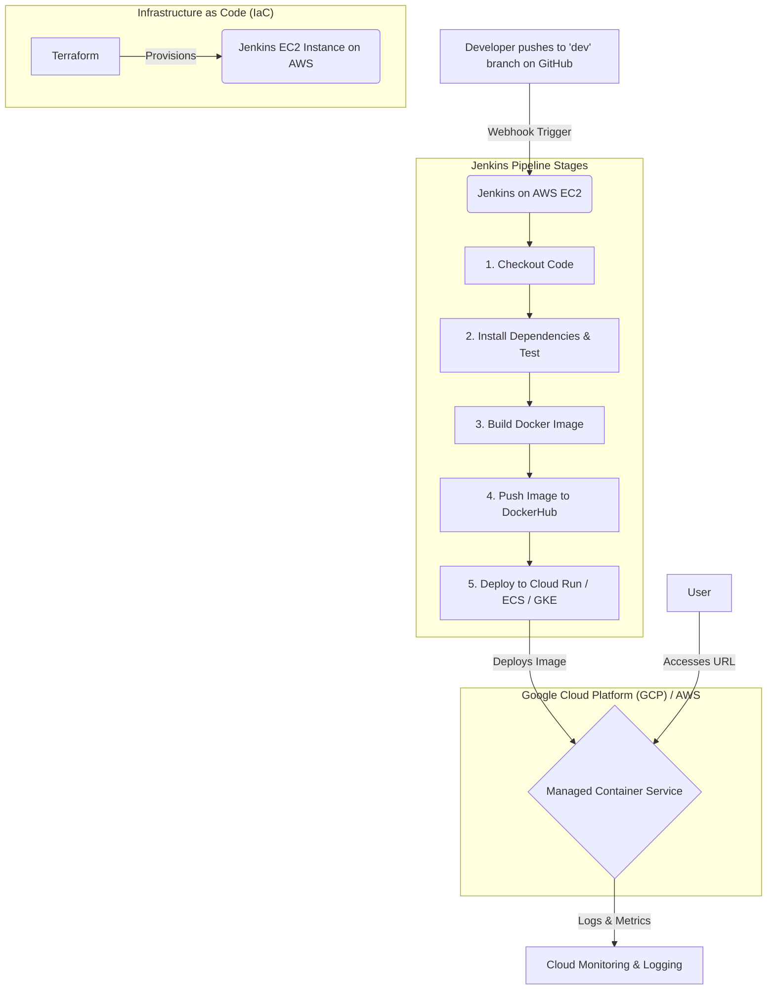

# DevOps Task: CI/CD Pipeline for a Node.js Application

## 1. Table of Contents
- [Objective](#1-objective)  
- [Architecture Diagram](#6-architecture-diagram)  
- [Pipeline Flow](#7-pipeline-flow)  
- [Tech Stack](#8-tech-stack)  
- [Setup and Deployment Instructions](#9-setup-and-deployment-instructions)  
  - [Prerequisites](#prerequisites)  
  - [Step 1: Provision Jenkins Server (Terraform)](#step-1-provision-jenkins-server-terraform)  
  - [Step 2: Configure Jenkins](#step-2-configure-jenkins)  
  - [Step 3: Create Jenkins Pipeline](#step-3-create-jenkins-pipeline)  
  - [Step 4: Configure GitHub Webhook](#step-4-configure-github-webhook)  
  - [Step 5: Trigger the Pipeline](#step-5-trigger-the-pipeline)  
- [Monitoring and Logging](#monitoring-and-logging)  
- [Project Insights (Write-up)](#project-insights-write-up)  
- [Deployment Proof / Checklist](#deployment-proof--checklist)  
- [Submission](#submission)

---

## 2. Architecture Diagram

The following diagram illustrates the flow of the CI/CD pipeline from code commit to deployment:



---

## 3. Pipeline Flow

- **Trigger:** Developer pushes new code to the `dev` branch.  
- **Webhook:** GitHub webhook notifies Jenkins.  
- **Checkout:** Jenkins checks out the latest source code.  
- **Build & Test:** Jenkins installs Node.js dependencies (`npm install`) and runs tests (`npm test`).  
- **Docker Build:** Jenkins builds a Docker image using `Dockerfile`.  
- **Push to Registry:** Image is tagged and pushed to DockerHub / ECR / Artifact Registry.  
- **Deploy:** Jenkins authenticates with the cloud provider and deploys the new image (Cloud Run / ECS / GKE).  
- **Monitor:** Logs & metrics are captured in CloudWatch / Cloud Logging and visible in the cloud console.

---

## 4. Tech Stack
- **Cloud Providers:** AWS (Jenkins host), GCP (App deployment)  
- **CI/CD:** Jenkins  
- **IaC:** Terraform  
- **Containerization:** Docker  
- **Registry:** DockerHub  
- **Deployment Platform:** Google Cloud Run  
- **Version Control:** GitHub  
- **Application:** Node.js / Express.js

---

## 5. Setup and Deployment Instructions

### Prerequisites
- AWS account with CLI configured (`aws configure`).  
- GCP project with `gcloud` CLI installed.  
- DockerHub account.  
- Terraform CLI.  
- GitHub repository forked from the sample app.  
- SSH key pair for accessing Jenkins EC2.

---

### Step 1: Provision Jenkins Server (Terraform on AWS)
Ensure your `terraform/` directory contains your `main.tf`.

Generate an SSH keypair if you haven't:

```bash
ssh-keygen -t rsa -b 4096 -f ~/.ssh/devops-task
```

Update `terraform/main.tf` to reference your public key:

```hcl
public_key = file("~/.ssh/devops-task.pub")
```

Initialize and apply Terraform:

```bash
cd terraform
terraform init
terraform apply -auto-approve
```

Note the Terraform output for the Jenkins EC2 public IP.

---

### Step 2: Configure Jenkins
Open Jenkins in a browser:

```
http://<JENKINS_EC2_PUBLIC_IP>:8080
```

Get initial admin password:

```bash
ssh -i ~/.ssh/devops-task ec2-user@<JENKINS_EC2_PUBLIC_IP> 'sudo cat /var/lib/jenkins/secrets/initialAdminPassword'
```

Complete the setup wizard and install suggested plugins.

Add Credentials in Jenkins (Manage Jenkins -> Credentials):

- DockerHub (Username/password) → ID: `dockerhub-creds`  
- GCP Service Account JSON (Secret file) → ID: `gcp-service-account`

Ensure Jenkins can run Docker:

```bash
sudo usermod -aG docker jenkins
sudo systemctl restart jenkins
```

---

### Step 3: Create the Jenkins Pipeline
On Jenkins → **New Item** → **Pipeline**.

- Name it (e.g., `devops-task-pipeline`).  
- In the Pipeline section, select **Pipeline script from SCM**.  
- **SCM:** Git  
- **Repository URL:** your forked repo URL  
- **Branch Specifier:** `*/dev`  
- **Script Path:** `Jenkinsfile`  

Save the pipeline.

---

### Step 4: Configure GitHub Webhook
In your GitHub repository → **Settings → Webhooks → Add webhook**.

- **Payload URL:** `http://<JENKINS_EC2_PUBLIC_IP>:8080/github-webhook/`  
- **Content type:** `application/json`  

Save the webhook.

---

### Step 5: Trigger the Pipeline
Push a commit to the `dev` branch. Jenkins should receive the webhook and start the pipeline.

Verify all stages run successfully and the deployment completes.

---

## Monitoring and Logging
- **GCP Cloud Logging & Monitoring:** View logs and metrics for your Cloud Run service.  
- Use the GCP console to inspect logs, set alerts, and analyze performance metrics like **request count** and **latency**.

---

## Project Insights (Write-up)

### Tools & Services Used
- **Jenkins (CI/CD):** Chosen for its flexibility and robust plugin ecosystem.  
- **Terraform (IaC):** Used to automate the provisioning of the Jenkins server on AWS.  
- **Docker & DockerHub (Containerization & Registry):** To create a consistent application environment and store the resulting image.  
- **Google Cloud Run (Deployment Target):** A serverless platform that simplifies deployment and scaling.  

### Challenges Faced & Solutions
- **Jenkins Docker Permissions:** Solved by adding the `jenkins` user to the `docker` group on the EC2 host.  
- **Secure Credentials Handling:** Used the Jenkins Credentials plugin and the `withCredentials` step to avoid exposing secrets in logs or code.  
- **gcloud Not Found in Pipeline:** Ensured the Google Cloud SDK was installed on the Jenkins host and its path was correctly configured in the `Jenkinsfile`.
- **Slow Google Cloud Run Deployment (Timeouts):** Initially, deployments to Cloud Run were taking too long and failing with a timeout. After debugging by building the Docker image locally, I discovered that the absence of a .dockerignore file was causing unnecessary large files (like terraform.exe, ~700 MB) to be included in the Docker image. This drastically increased the image size and deployment time. Added a .dockerignore file to exclude unnecessary files and binaries (e.g., terraform.exe, node_modules, logs). This reduced the image size significantly and allowed Cloud Run deployments to succeed within the expected time. 

### Possible Improvements
- **Use Cloud-Native Registries:** Instead of DockerHub, using AWS ECR or GCP Artifact Registry would offer better security and IAM integration.  
- **Full IaC Coverage:** Expand Terraform to also provision the application infrastructure (the Cloud Run service itself), making the entire project reproducible.  
- **Add a Real Test Stage:** Implement a proper testing framework like Jest or Mocha to run meaningful tests and improve code quality.  
- **Vulnerability Scanning:** Add a pipeline stage using a tool like Trivy to scan the Docker image for known vulnerabilities before deployment.  
- **Multi-Environment Pipeline:** Create a more advanced pipeline that deploys to a staging environment from the `dev` branch and a production environment from the `main` branch.  